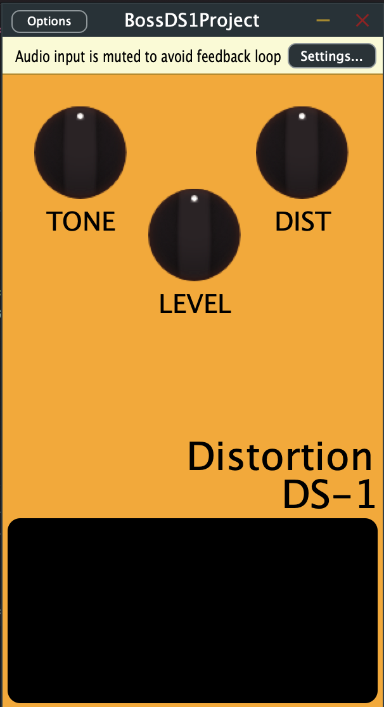

# AET5430_BossDS1Project

# JUCE C++ Audio Plugin (Distortion)

This project is a C++ audio plugin built using the JUCE framework, focused on real-time audio processing and DSP experimentation.

## Key Concepts
- Real-time audio processing constraints
- Low-latency signal flow
- Basic DSP (distortion / waveshaping)
- Plugin architecture (VST/AU)

## Notes
More recent work (private/professional) includes:
- Real-time spectrum analysis systems (FFT, threading, rendering pipelines)
- GPU-accelerated visualization (OpenGL)
- Thread-safe audio/UI decoupling

This repo represents early foundational work; newer systems are more advanced and performance-focused.
